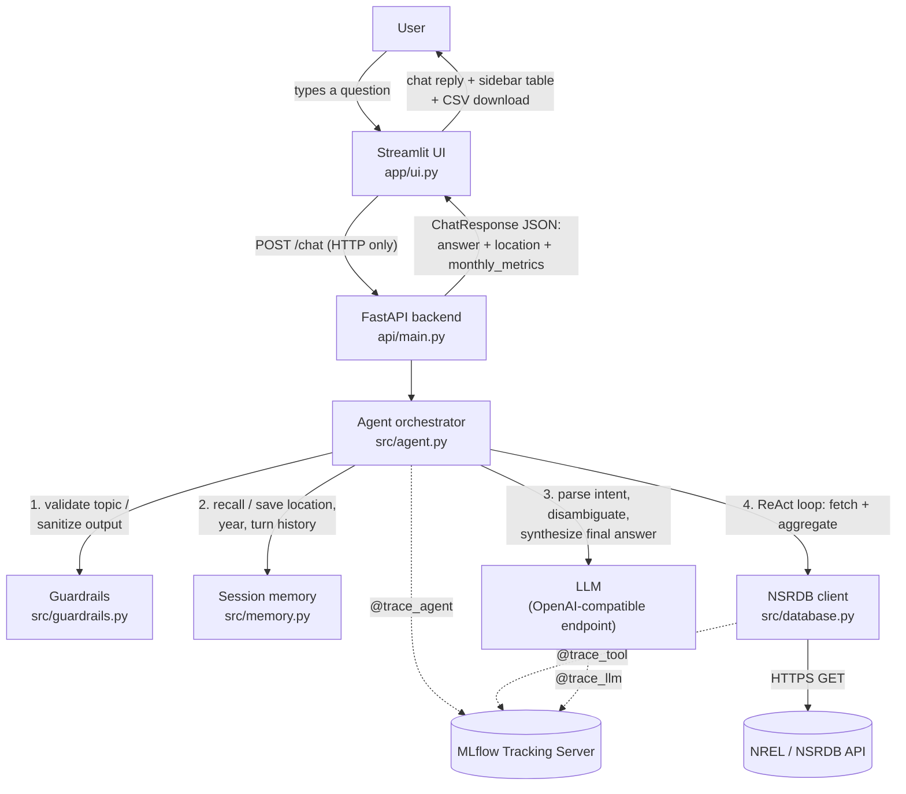

# AGENT P — Predictive & Parametric Solar Analytics Assistant

AGENT P turns natural-language questions about solar irradiation into precise,
structured answers pulled live from the NREL/NSRDB API. Ask it something like
*"Give me the monthly average irradiation from Feb to June in 2022 at our
warehouse location in Caloocan"* and it resolves the location, calls the
NSRDB API, aggregates the raw hourly data into monthly averages, and returns
a conversational answer plus a downloadable CSV — via both a web chat UI and
a REST API.

Built for the STAI100 Midterm Capstone (Stratpoint x DLSU). See
[`[IMPORTANT]-project-business-case.md`](%5BIMPORTANT%5D-project-business-case.md)
for the full business case.

---

## Contents

- [Architecture](#architecture)
- [Repository structure](#repository-structure)
- [Module checklist coverage](#module-checklist-coverage)
- [Setup](#setup)
  - [Prerequisites](#prerequisites)
  - [Option A — run locally](#option-a--run-locally-python)
  - [Option B — run with Docker](#option-b--run-with-docker)
  - [Environment variables](#environment-variables)
- [Using the app](#using-the-app)
- [Module ownership](#module-ownership)
- [Known limitations](#known-limitations)

---

## Architecture



**Data flow for one turn:**

1. The UI POSTs the raw user message and a `session_id` to `/chat` — it never imports agent/database/config code directly, only `requests`.
2. The agent validates the message is on-topic (`src/guardrails.py`); off-topic messages are rejected before any LLM call.
3. It parses the message into structured slots (lat/lon, year, month range, attributes) via an LLM call, filling any gaps from `SessionMemory` (e.g. a remembered location from an earlier turn).
4. If required slots are still missing, it asks one clarifying question and stops there for this turn.
5. Otherwise it runs a bounded **ReAct loop** (`Thought` → `Action` → `Observation`) with exactly two tools available: `fetch_solar_data` (hits the real NSRDB API) and `aggregate_monthly` (deterministic Python — monthly mean per attribute, never left to the LLM to compute).
6. A final LLM pass turns the aggregated numbers into a conversational answer.
7. Every agent turn, tool call, and LLM call is wrapped in an MLflow span (`utils/telemetry.py`) so latency, token usage, and errors are all queryable in the MLflow UI.

**Why not RAG?** The business case explicitly calls this out: the workflow needs deterministic multi-step reasoning over a live external API and real arithmetic, not semantic retrieval over a static document set — so there's no vector store here. **Why not a SQL Agent?** There's no relational database in this system; the only external data source is the NSRDB HTTP API.

---

## Repository structure

```
.
├── api/
│   └── main.py           # FastAPI app — POST /chat, GET /health
├── app/
│   └── ui.py              # Streamlit chat UI (HTTP client of api/main.py only)
├── config/
│   ├── settings.py        # pydantic-settings: NREL / LLM / MLflow config
│   └── prompts.yaml       # System prompts (intent parsing, disambiguation, ...)
├── docker/
│   ├── entrypoint.sh      # Launches uvicorn + streamlit concurrently
│   └── healthcheck.py     # Docker HEALTHCHECK probe (checks both processes)
├── src/
│   ├── agent.py            # ReAct orchestrator — ties every module together
│   ├── database.py         # NREL/NSRDB HTTP client
│   ├── guardrails.py       # Input/output validation
│   └── memory.py           # Short-term per-session memory
├── utils/
│   └── telemetry.py       # MLflow tracing decorators (@trace_agent/tool/llm)
├── Dockerfile              # Multi-stage build (builder venv -> slim runtime)
├── requirements.txt
├── .env.example
└── README.md
```

---

## Module checklist coverage

| Module (per course checklist) | Implementation | Owner |
| --- | --- | --- |
| Prompt Engineering | [`config/prompts.yaml`](config/prompts.yaml) — persona, few-shot intent parser, disambiguation, aggregation, and response-generation prompts, iterated independently of code | _TODO: name_ |
| Structured Outputs | [`api/main.py`](api/main.py) `ChatRequest`/`ChatResponse` Pydantic models; [`src/agent.py`](src/agent.py) `AgentResponse` dataclass and JSON-schema intent slots | _TODO: name_ |
| Disambiguation | [`src/agent.py`](src/agent.py) `_missing_fields()` / `_generate_clarification()` — asks one clarifying question when required slots are unresolved | _TODO: name_ |
| Memory | [`src/memory.py`](src/memory.py) `SessionMemory` — remembers the last resolved location, year, attributes, and turn history per session | _TODO: name_ |
| Guardrails | [`src/guardrails.py`](src/guardrails.py) — topic allow-list for input, raw-error-leak detection for output | _TODO: name_ |
| ReAct Agent | [`src/agent.py`](src/agent.py) `_run_react_loop()` — bounded Thought/Action/Observation loop over `fetch_solar_data`/`aggregate_monthly` | _TODO: name_ |
| Tool Use | [`src/database.py`](src/database.py) — real HTTP GET integration with the NREL/NSRDB API | _TODO: name_ |
| Chat UI | [`app/ui.py`](app/ui.py) — Streamlit conversational interface with a live metrics sidebar | _TODO: name_ |
| API Endpoint | [`api/main.py`](api/main.py) — FastAPI REST endpoint (`/chat`, `/health`) | _TODO: name_ |
| LLMOps Monitoring | [`utils/telemetry.py`](utils/telemetry.py) — `@trace_agent`/`@trace_tool`/`@trace_llm` MLflow span decorators, with secret redaction | _TODO: name_ |
| Dockerization | [`Dockerfile`](Dockerfile), [`docker/entrypoint.sh`](docker/entrypoint.sh) — multi-stage build running both services in one container | _TODO: name_ |
| RAG | Not used — see [Architecture](#architecture) for why | — |
| SQL Agent | Not used — no relational database in this system | — |

> That's 11 of the 13 checklist modules implemented. Replace the `_TODO: name_`
> placeholders in the [Module ownership](#module-ownership) table below with
> your actual team's assignments — the split there is only a suggested
> starting point.

---

## Setup

### Prerequisites

- Python 3.11+
- Docker Desktop (or Docker Engine), if using the containerized path
- A free NREL API key — sign up at <https://developer.nlr.gov/signup/> (NREL's developer
  portal moved from `developer.nrel.gov` to `developer.nlr.gov`; both are registered to
  DOE/NREL per the official CISA `.gov` registry, so this isn't a typo)
- An OpenAI-API-compatible LLM endpoint. Either:
  - **Local:** [Ollama](https://ollama.com) — `ollama serve`, then `ollama pull llama3.2:3b` (or any model you configure)
  - **Hosted:** any OpenAI-compatible provider — set `LLM_BASE_URL` / `LLM_API_KEY` / `LLM_MODEL` accordingly
- An MLflow tracking server reachable at `MLFLOW_TRACKING_URI`. The app only
  ships the lightweight `mlflow-skinny` *client* — it logs traces to whatever
  server you point it at, it does not run a server itself. For local dev:
  ```bash
  pip install mlflow
  mlflow server --host 0.0.0.0 --port 5000 --backend-store-uri sqlite:///mlflow.db
  ```

### Option A — run locally (Python)

```bash
git clone <this-repo>
cd STAI100_Capstone-1-G01

python -m venv .venv
source .venv/bin/activate        # Windows: .venv\Scripts\activate

pip install -r requirements.txt

cp .env.example .env             # then fill in NREL_API_KEY, NREL_API_EMAIL, etc.
```

Then, in separate terminals:

```bash
mlflow server --host 0.0.0.0 --port 5000 --backend-store-uri sqlite:///mlflow.db
ollama serve                                    # skip if using a hosted LLM
uvicorn api.main:app --reload --port 8000
streamlit run app/ui.py
```

Open <http://localhost:8501>.

### Option B — run with Docker

The `Dockerfile` is a multi-stage build: a `builder` stage installs
dependencies into a venv, and a slim `runtime` stage copies only that venv
plus the application code (no compilers, no notebooks, no pip cache). A
single container then runs **both** the FastAPI backend and the Streamlit UI
as sibling processes (`docker/entrypoint.sh`); either one exiting brings the
container down instead of leaving a half-dead process behind.

```bash
cp .env.example .env             # fill in real values first

docker build -t agent-p .

docker run --rm -p 8000:8000 -p 8501:8501 --env-file .env agent-p
```

Open <http://localhost:8501> (UI) — the API is at <http://localhost:8000>
(`/health`, `/chat`).

> If your MLflow server or Ollama instance runs on your host machine rather
> than inside a container, point `.env` at `http://host.docker.internal:<port>`
> instead of `localhost` so the container can reach them.
>
> **MLflow gotcha:** recent MLflow server versions reject requests whose
> `Host` header isn't on an allow-list (DNS-rebinding protection), and
> `host.docker.internal` isn't allowed by default. If traces silently fail
> with `Invalid Host header`, start your MLflow server with
> `--allowed-hosts "localhost,127.0.0.1,host.docker.internal:*"` (the `:*`
> matters — the check matches the full `host:port` string, and setting
> `--allowed-hosts` at all replaces the defaults rather than extending them,
> so re-list `localhost`/`127.0.0.1` too).

### Environment variables

| Variable | Default | Used by |
| --- | --- | --- |
| `NREL_API_KEY` | _(required)_ | `src/database.py` |
| `NREL_API_EMAIL` | _(required)_ | `src/database.py` |
| `NREL_NSRDB_BASE_URL` | Himawari (Asia/Pacific) download endpoint | `src/database.py` |
| `NREL_REQUEST_TIMEOUT_SECONDS` | `60` | `src/database.py` |
| `LLM_BASE_URL` | `http://localhost:11434/v1` | `src/agent.py` |
| `LLM_API_KEY` | `ollama` | `src/agent.py` |
| `LLM_MODEL` | `llama3.2:3b` | `src/agent.py` |
| `MLFLOW_TRACKING_URI` | `http://localhost:5000` | `utils/telemetry.py` |
| `MLFLOW_REGISTRY_URI` | _(unset)_ | `utils/telemetry.py` |
| `MLFLOW_EXPERIMENT_NAME` | `agent-p-solar-analytics` | `utils/telemetry.py` |
| `AGENT_P_API_URL` | `http://localhost:8000` | `app/ui.py` only |

Full definitions live in [`config/settings.py`](config/settings.py).

---

## Using the app

**Web UI:** open the Streamlit app, type a question, and the sidebar fills
in with the resolved site, year, month range, and a monthly-averages table
(with a CSV download button) once the agent has a complete answer.

**REST API:**

```bash
curl -X POST http://localhost:8000/chat \
  -H "Content-Type: application/json" \
  -d '{
        "query": "Give me the monthly average irradiation from Feb to June in 2022 at our warehouse location in Caloocan.",
        "session_id": "demo-user"
      }'
```

```json
{
  "answer": "Good news — your Caloocan warehouse looks solar-viable for Feb-June 2022...",
  "session_id": "demo-user",
  "needs_clarification": false,
  "location": { "latitude": 14.6499, "longitude": 120.9833, "name": "Caloocan warehouse" },
  "year": 2022,
  "start_month": 2,
  "end_month": 6,
  "attributes": ["ghi", "dni"],
  "monthly_metrics": {
    "2": { "ghi": 470.0, "dni": 636.67 },
    "3": { "ghi": 545.0, "dni": 680.0 }
  }
}
```

If a required field (location, year, month range) can't be resolved,
`needs_clarification` comes back `true` and `answer` holds the follow-up
question instead — send it again with the missing detail included.

---

## Module ownership

Each team member should own and be able to explain at least two modules
(per the course requirement). Suggested split based on how the code is
grouped — adjust to match your actual team size and who built what:

| Team member | Modules owned |
| --- | --- |
| _TODO: name_ | Prompt Engineering, Disambiguation |
| _TODO: name_ | Tool Use, API Endpoint, Dockerization |
| _TODO: name_ | ReAct Agent, Memory, LLMOps Monitoring |
| _TODO: name_ | Guardrails, Structured Outputs, Chat UI |

---

## Known limitations

- The ReAct loop is capped at 6 turns (`MAX_REACT_TURNS` in `src/agent.py`);
  a small/local LLM that doesn't follow the `Action:`/`Final Answer:` format
  reliably can exhaust that budget and fall back to an apology message.
- Session memory (`src/memory.py`) is in-process only — it resets on
  container restart and doesn't survive multiple API replicas. Fine for a
  single-container demo; would need a shared store (Redis, DB) to scale out.
- NSRDB coverage is region-specific (Himawari for Asia/Pacific, PSM3 for the
  Americas, etc.) — the default endpoint in `config/settings.py` only covers
  one region at a time.
