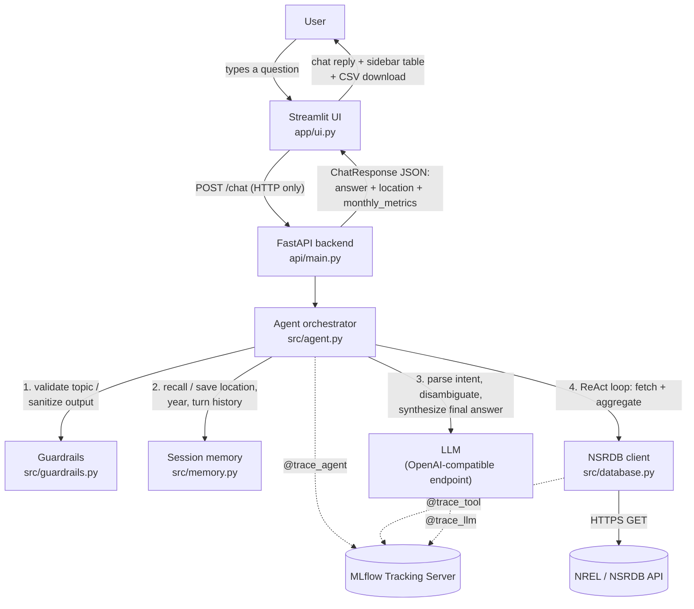

# AGENT P — Predictive & Parametric Solar Analytics Assistant

AGENT P turns natural-language questions about solar irradiation into precise,
structured answers pulled live from the NREL/NSRDB API. Ask it something like
*"Give me the monthly average irradiation from Feb to June in 2019 at our
warehouse location in Caloocan"* and it resolves the location, calls the
NSRDB API, aggregates the raw hourly data into monthly averages, and returns
a conversational answer plus a downloadable CSV — via both a web chat UI and
a REST API.

Built for the STAI100 Midterm Capstone (Stratpoint x DLSU). See
[`[IMPORTANT]-project-business-case.md`](%5BIMPORTANT%5D-project-business-case.md)
for the full business case.

---

## Contents

- [Architecture](#architecture)
- [Repository structure](#repository-structure)
- [Module checklist coverage](#module-checklist-coverage)
- [Running the project](#running-the-project)
  - [Cheat sheet](#cheat-sheet)
  - [Prerequisites](#prerequisites)
  - [One-time setup](#one-time-setup)
  - [Supporting services (both options need these)](#supporting-services-both-options-need-these)
  - [Option A — run locally with Python](#option-a--run-locally-with-python)
  - [Option B — run with Docker](#option-b--run-with-docker)
  - [Verify everything is running](#verify-everything-is-running)
  - [Environment variables](#environment-variables)
  - [Troubleshooting](#troubleshooting)
- [Using the app](#using-the-app)
- [Module ownership](#module-ownership)
- [Known limitations](#known-limitations)

---

## Architecture



**Data flow for one turn:**

1. The UI POSTs the raw user message and a `session_id` to `/chat` — it never imports agent/database/config code directly, only `requests`.
2. The agent validates the message is on-topic (`src/guardrails.py`); off-topic messages are rejected before any LLM call.
3. It parses the message into structured slots (lat/lon, year, month range, attributes) via an LLM call, filling any gaps from `SessionMemory` (e.g. a remembered location from an earlier turn).
4. If required slots are still missing, it asks one clarifying question and stops there for this turn.
5. Otherwise it runs a bounded **ReAct loop** (`Thought` → `Action` → `Observation`) with exactly two tools available: `fetch_solar_data` (hits the real NSRDB API) and `aggregate_monthly` (deterministic Python — monthly mean per attribute, never left to the LLM to compute).
6. A final LLM pass turns the aggregated numbers into a conversational answer.
7. Every agent turn, tool call, and LLM call is wrapped in an MLflow span (`utils/telemetry.py`) so latency, token usage, and errors are all queryable in the MLflow UI.

**Why not RAG?** The business case explicitly calls this out: the workflow needs deterministic multi-step reasoning over a live external API and real arithmetic, not semantic retrieval over a static document set — so there's no vector store here. **Why not a SQL Agent?** There's no relational database in this system; the only external data source is the NSRDB HTTP API.

---

## Repository structure

```
.
├── api/
│   └── main.py           # FastAPI app — POST /chat, GET /health
├── app/
│   └── ui.py              # Streamlit chat UI (HTTP client of api/main.py only)
├── config/
│   ├── settings.py        # pydantic-settings: NREL / LLM / MLflow config
│   └── prompts.yaml       # System prompts (intent parsing, disambiguation, ...)
├── docker/
│   ├── entrypoint.sh      # Launches uvicorn + streamlit concurrently
│   └── healthcheck.py     # Docker HEALTHCHECK probe (checks both processes)
├── src/
│   ├── agent.py            # ReAct orchestrator — ties every module together
│   ├── database.py         # NREL/NSRDB HTTP client
│   ├── guardrails.py       # Input/output validation
│   └── memory.py           # Short-term per-session memory
├── utils/
│   └── telemetry.py       # MLflow tracing decorators (@trace_agent/tool/llm)
├── Dockerfile              # Multi-stage build (builder venv -> slim runtime)
├── requirements.txt
├── .env.example
└── README.md
```

> `notebook*.py`, `sample_*.py`, and the other `*.md` write-ups at the repo
> root are Week 1–7 reference/scratch material (kept for grading history).
> The running app never imports them — `.dockerignore` excludes all of them
> from the container image, and you don't need to run them to use AGENT P.

---

## Module checklist coverage

| Module (per course checklist) | Implementation | Owner |
| --- | --- | --- |
| Prompt Engineering | [`config/prompts.yaml`](config/prompts.yaml) — persona, few-shot intent parser, disambiguation, aggregation, and response-generation prompts, iterated independently of code | _TODO: name_ |
| Structured Outputs | [`api/main.py`](api/main.py) `ChatRequest`/`ChatResponse` Pydantic models; [`src/agent.py`](src/agent.py) `AgentResponse` dataclass and JSON-schema intent slots | _TODO: name_ |
| Disambiguation | [`src/agent.py`](src/agent.py) `_missing_fields()` / `_generate_clarification()` — asks one clarifying question when required slots are unresolved | _TODO: name_ |
| Memory | [`src/memory.py`](src/memory.py) `SessionMemory` — remembers the last resolved location, year, attributes, and turn history per session | _TODO: name_ |
| Guardrails | [`src/guardrails.py`](src/guardrails.py) — topic allow-list for input, raw-error-leak detection for output | _TODO: name_ |
| ReAct Agent | [`src/agent.py`](src/agent.py) `_run_react_loop()` — bounded Thought/Action/Observation loop over `fetch_solar_data`/`aggregate_monthly` | _TODO: name_ |
| Tool Use | [`src/database.py`](src/database.py) — real HTTP GET integration with the NREL/NSRDB API | _TODO: name_ |
| Chat UI | [`app/ui.py`](app/ui.py) — Streamlit conversational interface with a live metrics sidebar | _TODO: name_ |
| API Endpoint | [`api/main.py`](api/main.py) — FastAPI REST endpoint (`/chat`, `/health`) | _TODO: name_ |
| LLMOps Monitoring | [`utils/telemetry.py`](utils/telemetry.py) — `@trace_agent`/`@trace_tool`/`@trace_llm` MLflow span decorators, with secret redaction | _TODO: name_ |
| Dockerization | [`Dockerfile`](Dockerfile), [`docker/entrypoint.sh`](docker/entrypoint.sh) — multi-stage build running both services in one container | _TODO: name_ |
| RAG | Not used — see [Architecture](#architecture) for why | — |
| SQL Agent | Not used — no relational database in this system | — |

> That's 11 of the 13 checklist modules implemented. Replace the `_TODO: name_`
> placeholders in the [Module ownership](#module-ownership) table below with
> your actual team's assignments — the split there is only a suggested
> starting point.

---

## Running the project

There are **up to four moving pieces**, and each one is a long-running
process that needs to keep its own terminal window open: an MLflow tracking
server, an LLM endpoint (Ollama, unless you're using a hosted provider), and
the app itself (FastAPI + Streamlit — either as two local Python processes,
or as one Docker container). Nothing below needs to be run as Administrator/root.

### Cheat sheet

Once setup is done, this is everything at a glance. Full context for each row
is in the sections below — **don't copy-paste from this table alone the
first time**, since it skips the `cd`/activate steps you need in every new
terminal.

| Terminal | Runs | Port | Command |
| --- | --- | --- | --- |
| 1 | MLflow tracking server | 5000 | `mlflow server --host 0.0.0.0 --port 5000 --backend-store-uri sqlite:///.mlflow/mlflow.db` |
| 2 | LLM endpoint (skip if Ollama's already running) | 11434 | `ollama serve` |
| 3 *(Option A)* | FastAPI backend | 8000 | `python -m uvicorn api.main:app --reload --port 8000` |
| 4 *(Option A)* | Streamlit UI | 8501 | `python -m streamlit run app/ui.py` |
| 3 *(Option B, instead of A)* | Docker container (API + UI together) | 8000, 8501 | `docker run --rm -p 8000:8000 -p 8501:8501 --env-file .env agent-p` |

So: **4 terminals** for local development (Option A), or **3 terminals** if
you run the app via Docker (Option B) — 2 either way for MLflow/Ollama.

**Shortcut:** [`scripts/`](scripts/) has one script per terminal above
(`run-mlflow`, `run-ollama`, `run-api`, `run-ui`, both `.ps1` and `.sh`
variants) plus `run-all.ps1`, which opens all four in their own PowerShell
windows for you — `powershell -File scripts\run-all.ps1` from the repo root
after [one-time setup](#one-time-setup). This whole stack (venv rebuild,
`ollama pull llama3.2:3b`, all four services, and a real end-to-end `/chat`
request against the live NREL API) was verified working on 2026-07-08.

### Prerequisites

- **Python 3.11+**
- **Git**
- **Docker Desktop** (or Docker Engine) — only if you're using Option B
- A free **NREL API key** — sign-up link is in [`.env.example`](.env.example)
- An **OpenAI-API-compatible LLM endpoint**. Either:
  - **Local (recommended for development):** [Ollama](https://ollama.com)
  - **Hosted:** any OpenAI-compatible provider — set `LLM_BASE_URL` / `LLM_API_KEY` / `LLM_MODEL` in `.env` accordingly
- **MLflow** — the app only ships the lightweight `mlflow-skinny` *client* in
  `requirements.txt` (it logs traces to whatever server you point it at). To
  actually run a tracking server locally you need the full `mlflow` package
  too (installed in [One-time setup](#one-time-setup) below).

### One-time setup

> This repo currently has a `.venv/` folder from a previous machine committed
> alongside the source. **Don't try to activate that one** — a virtualenv
> embeds absolute paths from the machine it was created on, so it will not
> work on yours. Create your own with the steps below; it's a normal, harmless
> step even though a `.venv/` folder already exists.

**Windows (PowerShell):**

```powershell
git clone https://github.com/nakaraan/stai100-midtermcapstone-draft.git
cd stai100-midtermcapstone-draft

python -m venv .venv
.venv\Scripts\Activate.ps1
# If PowerShell refuses to run the script ("running scripts is disabled on
# this system"), run this once first, then retry the line above:
#   Set-ExecutionPolicy -Scope Process -ExecutionPolicy Bypass

pip install -r requirements.txt
pip install mlflow

Copy-Item .env.example .env
notepad .env
# fill in NREL_API_KEY, NREL_API_EMAIL, and anything else you're overriding, then save+close
```

**macOS/Linux (bash/zsh):**

```bash
git clone https://github.com/nakaraan/stai100-midtermcapstone-draft.git
cd stai100-midtermcapstone-draft

python3 -m venv .venv
source .venv/bin/activate

pip install -r requirements.txt
pip install mlflow

cp .env.example .env
nano .env
# fill in NREL_API_KEY, NREL_API_EMAIL, and anything else you're overriding, then save (Ctrl+O, Ctrl+X)
```

**If you're using Ollama**, also pull a model (same command, either OS —
run it in any terminal, doesn't need to be one of the 4 above):

```
ollama pull llama3.2:3b
```

`llama3.2:3b` is the configured default (see `.env.example`), but the team's
own testing (see the comment above `MAX_REACT_TURNS` in
[`src/agent.py`](src/agent.py)) found **`qwen2.5:7b` follows the agent's
Thought/Action format more reliably**. If you have the RAM for a 7B model,
it's worth pulling instead and setting `LLM_MODEL=qwen2.5:7b` in `.env`:

```
ollama pull qwen2.5:7b
```

### Supporting services (both options need these)

Every terminal below is a **new shell window** — activate the venv again in
each one (activation only applies to the shell session you ran it in), and
make sure you're in the repo root (`config/settings.py` loads `.env` relative
to your current directory, not the repo location, so running from the wrong
folder silently skips your `.env`).

**Terminal 1 — MLflow tracking server**

PowerShell:
```powershell
cd stai100-midtermcapstone-draft
.venv\Scripts\Activate.ps1
mlflow server --host 0.0.0.0 --port 5000 --backend-store-uri sqlite:///.mlflow/mlflow.db
```

bash/zsh:
```bash
cd stai100-midtermcapstone-draft
source .venv/bin/activate
mlflow server --host 0.0.0.0 --port 5000 --backend-store-uri sqlite:///.mlflow/mlflow.db
```

> **Only if you'll use Option B (Docker) below**, add `--allowed-hosts` to
> that command, because the container reaches this server as
> `host.docker.internal`, and recent MLflow versions reject unrecognized
> `Host` headers by default:
> ```
> mlflow server --host 0.0.0.0 --port 5000 --backend-store-uri sqlite:///.mlflow/mlflow.db --allowed-hosts "localhost,127.0.0.1,host.docker.internal:*"
> ```
> (The `:*` matters — the check matches the full `host:port` string — and
> setting `--allowed-hosts` at all replaces the defaults rather than
> extending them, so `localhost`/`127.0.0.1` are re-listed too.)

Leave this running. MLflow's UI is at <http://localhost:5000>.

**Terminal 2 — LLM endpoint**

Skip this terminal entirely if you're using a hosted LLM provider, or if
Ollama is already running as a background service (the Windows/Mac
installers set this up by default — check first with `ollama list` in any
terminal; if it prints a model list instead of a connection error, it's
already running and starting it again will just fail on the port).

PowerShell or bash/zsh (same command):
```
ollama serve
```

### Option A — run locally with Python

Best for active development (`--reload` picks up code changes automatically).
Continues the numbering above — 2 more terminals, 4 total.

**Terminal 3 — FastAPI backend**

PowerShell:
```powershell
cd stai100-midtermcapstone-draft
.venv\Scripts\Activate.ps1
python -m uvicorn api.main:app --reload --port 8000
```

bash/zsh:
```bash
cd stai100-midtermcapstone-draft
source .venv/bin/activate
python -m uvicorn api.main:app --reload --port 8000
```

If this crashes immediately with a Pydantic `ValidationError` mentioning
`nrel_api_key` or `nrel_api_email`, your `.env` is missing, incomplete, or
you're not running the command from the repo root.

**Terminal 4 — Streamlit UI**

PowerShell:
```powershell
cd stai100-midtermcapstone-draft
.venv\Scripts\Activate.ps1
python -m streamlit run app/ui.py
```

bash/zsh:
```bash
cd stai100-midtermcapstone-draft
source .venv/bin/activate
python -m streamlit run app/ui.py
```

Streamlit should open <http://localhost:8501> in your browser automatically;
if not, open it manually.

### Option B — run with Docker

Closest to how the grader will run it — packages the API and UI into one
container (`docker/entrypoint.sh` runs both as sibling processes; either one
exiting stops the container). MLflow and Ollama are **not** containerized
here, so Terminals 1 and 2 above still apply — this replaces only Terminals
3 and 4 with a single terminal.

Before building, point `.env` at your host machine instead of `localhost`,
since `localhost` inside the container refers to the container itself:

```
MLFLOW_TRACKING_URI=http://host.docker.internal:5000
LLM_BASE_URL=http://host.docker.internal:11434/v1
```

**Terminal 3 — build and run the container**

Same command on PowerShell or bash/zsh:
```
docker build -t agent-p .
docker run --rm -p 8000:8000 -p 8501:8501 --env-file .env agent-p
```

Open <http://localhost:8501> (UI) — the API is at <http://localhost:8000>.
To stop it, `Ctrl+C` in this terminal (the container was started with
`--rm`, so it's removed automatically on exit).

### Verify everything is running

Run these after Terminals 1–2 and either Option A or B are up.

1. **MLflow** — open <http://localhost:5000> in a browser, or:
   - PowerShell: `Invoke-RestMethod -Uri http://localhost:5000/health`
   - bash/zsh: `curl -s http://localhost:5000/health`
2. **API health** —
   - PowerShell: `Invoke-RestMethod -Uri http://localhost:8000/health`
   - bash/zsh: `curl -s http://localhost:8000/health`
   - Expect: `{"status":"ok"}`
3. **Full round trip** (agent + NREL + LLM + MLflow tracing, all at once) —
   - PowerShell:
     ```powershell
     Invoke-RestMethod -Uri "http://localhost:8000/chat" -Method Post -ContentType "application/json" -Body '{"query": "Give me the monthly average irradiation from Feb to June in 2019 at our warehouse location in Caloocan.", "session_id": "smoke-test"}'
     ```
   - bash/zsh:
     ```bash
     curl -s -X POST http://localhost:8000/chat \
       -H "Content-Type: application/json" \
       -d '{"query": "Give me the monthly average irradiation from Feb to June in 2019 at our warehouse location in Caloocan.", "session_id": "smoke-test"}'
     ```
   - Expect a JSON body with `"needs_clarification": false` and a populated `monthly_metrics`.
4. **UI** — open <http://localhost:8501>, ask the same question, confirm the sidebar fills in with a site, year, and monthly table plus a CSV download button.
5. **Tracing** — refresh the MLflow UI, open the `agent-p-solar-analytics` experiment, and confirm a new trace appeared for the request in step 3.

### Environment variables

| Variable | Default | Used by |
| --- | --- | --- |
| `NREL_API_KEY` | _(required)_ | `src/database.py` |
| `NREL_API_EMAIL` | _(required)_ | `src/database.py` |
| `NREL_NSRDB_BASE_URL` | Himawari (Asia/Pacific) download endpoint | `src/database.py` |
| `NREL_REQUEST_TIMEOUT_SECONDS` | `60` | `src/database.py` |
| `LLM_BASE_URL` | `http://localhost:11434/v1` | `src/agent.py` |
| `LLM_API_KEY` | `ollama` | `src/agent.py` |
| `LLM_MODEL` | `llama3.2:3b` | `src/agent.py` |
| `MLFLOW_TRACKING_URI` | `http://localhost:5000` | `utils/telemetry.py` |
| `MLFLOW_REGISTRY_URI` | _(unset)_ | `utils/telemetry.py` |
| `MLFLOW_EXPERIMENT_NAME` | `agent-p-solar-analytics` | `utils/telemetry.py` |
| `AGENT_P_API_URL` | `http://localhost:8000` | `app/ui.py` only |

Full definitions live in [`config/settings.py`](config/settings.py); exact
current values (including the NREL sign-up URL) are in
[`.env.example`](.env.example).

### Troubleshooting

| Symptom | Likely cause / fix |
| --- | --- |
| PowerShell: "`...Activate.ps1 cannot be loaded because running scripts is disabled on this system`" | Run `Set-ExecutionPolicy -Scope Process -ExecutionPolicy Bypass` once in that terminal, then retry activation. |
| "`uvicorn`/`streamlit`/`mlflow` is not recognized" | The venv isn't activated in *this* terminal — activation is per-window, redo it here even if you already did it elsewhere. |
| FastAPI crashes on startup with a Pydantic `ValidationError` | `.env` is missing/incomplete, or you ran the command from the wrong folder — `.env` is resolved relative to your current directory, not the repo path. |
| Agent keeps asking a clarifying question no matter what you answer | Check the requested **year is 2016–2020** — that's the only range the configured Himawari NSRDB endpoint covers (see [Known limitations](#known-limitations)); anything outside it gets silently nulled out and re-asked. |
| Docker container can't reach MLflow / Ollama, or traces never appear | `.env` still says `localhost` — from inside the container that means the container itself, not your host. Use `host.docker.internal` (see [Option B](#option-b--run-with-docker)), and make sure MLflow was started with `--allowed-hosts` including it. |
| Streamlit shows "I couldn't reach the AGENT P backend" | The FastAPI process (Terminal 3, or the Docker container) isn't running or crashed — check that terminal's output. |
| `ollama serve` fails because the port's in use | Ollama is probably already running as a background service — skip that terminal and confirm with `ollama list`. |

---

## Using the app

**Web UI:** open the Streamlit app, type a question, and the sidebar fills
in with the resolved site, year, month range, and a monthly-averages table
(with a CSV download button) once the agent has a complete answer.

**REST API:**

```bash
curl -X POST http://localhost:8000/chat \
  -H "Content-Type: application/json" \
  -d '{
        "query": "Give me the monthly average irradiation from Feb to June in 2019 at our warehouse location in Caloocan.",
        "session_id": "demo-user"
      }'
```

```json
{
  "answer": "Good news — your Caloocan warehouse looks solar-viable for Feb-June 2019...",
  "session_id": "demo-user",
  "needs_clarification": false,
  "location": { "latitude": 14.6499, "longitude": 120.9833, "name": "warehouse location in Caloocan" },
  "year": 2019,
  "start_month": 2,
  "end_month": 6,
  "attributes": ["ghi"],
  "monthly_metrics": {
    "2": { "ghi": 470.0 },
    "3": { "ghi": 545.0 }
  }
}
```

If a required field (location, year, month range) can't be resolved,
`needs_clarification` comes back `true` and `answer` holds the follow-up
question instead — send it again with the missing detail included. Note the
**year must fall within 2016–2020** (see [Known limitations](#known-limitations));
a query for, e.g., 2022 will not resolve and will instead loop back asking
for a valid year.

---

## Module ownership

Each team member should own and be able to explain at least two modules
(per the course requirement). Suggested split based on how the code is
grouped — adjust to match your actual team size and who built what:

| Team member | Modules owned |
| --- | --- |
| _TODO: name_ | Prompt Engineering, Disambiguation |
| _TODO: name_ | Tool Use, API Endpoint, Dockerization |
| _TODO: name_ | ReAct Agent, Memory, LLMOps Monitoring |
| _TODO: name_ | Guardrails, Structured Outputs, Chat UI |

---

## Known limitations

- The ReAct loop is capped at 6 turns (`MAX_REACT_TURNS` in `src/agent.py`);
  a small/local LLM that doesn't follow the `Action:`/`Final Answer:` format
  reliably can exhaust that budget and fall back to an apology message.
- **Only years 2016–2020 are accepted** (`NSRDB_MIN_YEAR`/`NSRDB_MAX_YEAR` in
  `src/agent.py`) — the real coverage of the configured Himawari (Asia/Pacific)
  endpoint. A year outside that range is treated as unresolved and triggers
  a clarification loop rather than a clear error; the original business-case
  sample query (2022) needs its year swapped for one in range to actually run.
- Session memory (`src/memory.py`) is in-process only — it resets on
  container restart and doesn't survive multiple API replicas. Fine for a
  single-container demo; would need a shared store (Redis, DB) to scale out.
- NSRDB coverage is region-specific (Himawari for Asia/Pacific, PSM3 for the
  Americas, etc.) — the default endpoint in `config/settings.py` only covers
  one region at a time.
