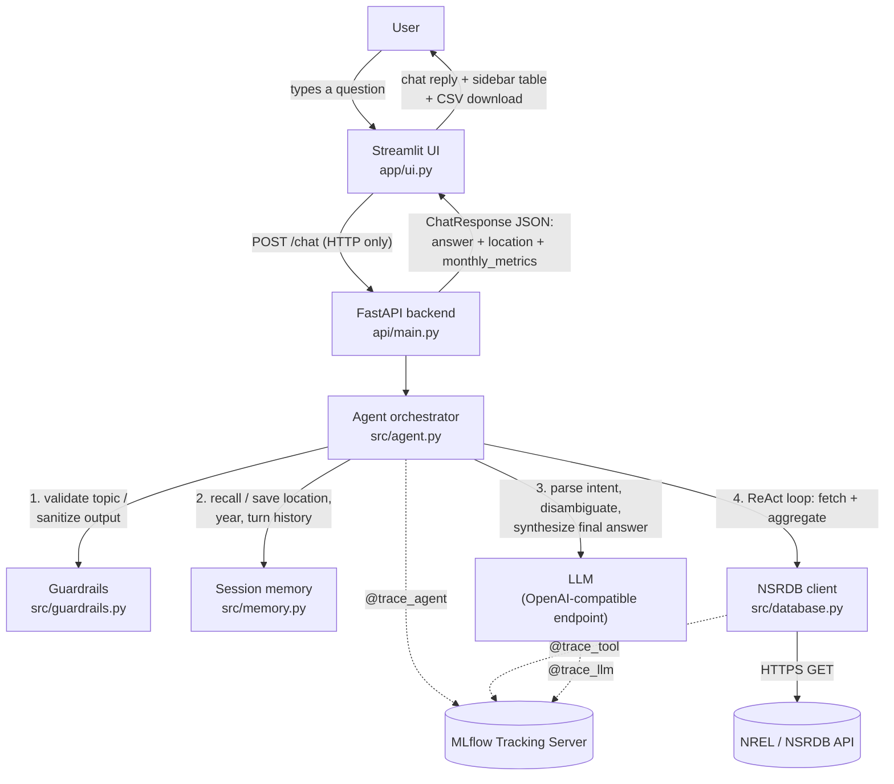

# AGENT P — Predictive & Parametric Solar Analytics Assistant

AGENT P turns natural-language questions about solar irradiation into precise,
structured answers pulled live from the NREL/NSRDB API. Ask it something like
*"Give me the monthly average irradiation from Feb to June in 2019 at our
warehouse location in Caloocan"* and it resolves the location, calls the
NSRDB API, aggregates the raw hourly data into monthly averages, and returns
a conversational answer plus a downloadable CSV — via both a web chat UI and
a REST API.

Built for the STAI100 Midterm Capstone (Stratpoint x DLSU). See
[`[IMPORTANT]-project-business-case.md`](%5BIMPORTANT%5D-project-business-case.md)
for the full business case.

---

## Contents

- [Architecture](#architecture)
- [Repository structure](#repository-structure)
- [Module checklist coverage](#module-checklist-coverage)
- [Running the project](#running-the-project)
  - [Prerequisites](#prerequisites)
  - [One-time setup](#one-time-setup)
  - [Start it (4 terminals)](#start-it-4-terminals)
  - [Verify it's working](#verify-its-working)
  - [Switching the LLM model](#switching-the-llm-model)
  - [Deploy it publicly (optional)](#deploy-it-publicly-optional)
  - [Docker (optional alternative)](#docker-optional-alternative)
  - [Troubleshooting](#troubleshooting)
- [Environment variables](#environment-variables)
- [Using the app](#using-the-app)
- [Module ownership](#module-ownership)
- [Known limitations](#known-limitations)

---

## Architecture



**Data flow for one turn:**

1. The UI POSTs the raw user message and a `session_id` to `/chat` — it never imports agent/database/config code directly, only `requests`.
2. The agent validates the message is on-topic (`src/guardrails.py`); off-topic messages are rejected before any LLM call.
3. It parses the message into structured slots (lat/lon, year, month range, attributes) via an LLM call, filling any gaps from `SessionMemory` (e.g. a remembered location from an earlier turn).
4. If required slots are still missing, it asks one clarifying question and stops there for this turn.
5. Otherwise it runs a bounded **ReAct loop** (`Thought` → `Action` → `Observation`) with exactly two tools available: `fetch_solar_data` (hits the real NSRDB API) and `aggregate_monthly` (deterministic Python — monthly mean per attribute, never left to the LLM to compute).
6. A final LLM pass turns the aggregated numbers into a conversational answer.
7. Every agent turn, tool call, and LLM call is wrapped in an MLflow span (`utils/telemetry.py`) so latency, token usage, and errors are all queryable in the MLflow UI.

**Why not RAG?** The business case explicitly calls this out: the workflow needs deterministic multi-step reasoning over a live external API and real arithmetic, not semantic retrieval over a static document set — so there's no vector store here. **Why not a SQL Agent?** There's no relational database in this system; the only external data source is the NSRDB HTTP API.

---

## Repository structure

```
.
├── api/
│   └── main.py           # FastAPI app — POST /chat, GET /health
├── app/
│   └── ui.py              # Streamlit chat UI (HTTP client of api/main.py only)
├── config/
│   ├── settings.py        # pydantic-settings: NREL / LLM / MLflow config
│   └── prompts.yaml       # System prompts (intent parsing, disambiguation, ...)
├── docker/
│   ├── entrypoint.sh      # Launches uvicorn + streamlit concurrently
│   └── healthcheck.py     # Docker HEALTHCHECK probe (checks both processes)
├── src/
│   ├── agent.py            # ReAct orchestrator — ties every module together
│   ├── database.py         # NREL/NSRDB HTTP client
│   ├── guardrails.py       # Input/output validation
│   └── memory.py           # Short-term per-session memory
├── utils/
│   └── telemetry.py       # MLflow tracing decorators (@trace_agent/tool/llm)
├── Dockerfile              # Multi-stage build (builder venv -> slim runtime)
├── requirements.txt
├── .env.example
└── README.md
```

> `notebook*.py`, `sample_*.py`, and the other `*.md` write-ups at the repo
> root are Week 1–7 reference/scratch material (kept for grading history).
> The running app never imports them — `.dockerignore` excludes all of them
> from the container image, and you don't need to run them to use AGENT P.

---

## Module checklist coverage

| Module (per course checklist) | Implementation | Owner |
| --- | --- | --- |
| Prompt Engineering | [`config/prompts.yaml`](config/prompts.yaml) — persona, few-shot intent parser, disambiguation, aggregation, and response-generation prompts, iterated independently of code | _TODO: name_ |
| Structured Outputs | [`api/main.py`](api/main.py) `ChatRequest`/`ChatResponse` Pydantic models; [`src/agent.py`](src/agent.py) `AgentResponse` dataclass and JSON-schema intent slots | _TODO: name_ |
| Disambiguation | [`src/agent.py`](src/agent.py) `_missing_fields()` / `_generate_clarification()` — asks one clarifying question when required slots are unresolved | _TODO: name_ |
| Memory | [`src/memory.py`](src/memory.py) `SessionMemory` — remembers the last resolved location, year, attributes, and turn history per session | _TODO: name_ |
| Guardrails | [`src/guardrails.py`](src/guardrails.py) — topic allow-list for input, raw-error-leak detection for output | _TODO: name_ |
| ReAct Agent | [`src/agent.py`](src/agent.py) `_run_react_loop()` — bounded Thought/Action/Observation loop over `fetch_solar_data`/`aggregate_monthly` | _TODO: name_ |
| Tool Use | [`src/database.py`](src/database.py) — real HTTP GET integration with the NREL/NSRDB API | _TODO: name_ |
| Chat UI | [`app/ui.py`](app/ui.py) — Streamlit conversational interface with a live metrics sidebar | _TODO: name_ |
| API Endpoint | [`api/main.py`](api/main.py) — FastAPI REST endpoint (`/chat`, `/health`) | _TODO: name_ |
| LLMOps Monitoring | [`utils/telemetry.py`](utils/telemetry.py) — `@trace_agent`/`@trace_tool`/`@trace_llm` MLflow span decorators, with secret redaction | _TODO: name_ |
| Dockerization | [`Dockerfile`](Dockerfile), [`docker/entrypoint.sh`](docker/entrypoint.sh) — multi-stage build running both services in one container | _TODO: name_ |
| RAG | Not used — see [Architecture](#architecture) for why | — |
| SQL Agent | Not used — no relational database in this system | — |

> That's 11 of the 13 checklist modules implemented. Replace the `_TODO: name_`
> placeholders in the [Module ownership](#module-ownership) table below with
> your actual team's assignments — the split there is only a suggested
> starting point.

---

## Running the project

**Everything below is plain commands, run by hand — no scripts, no wrapper
tooling required.** Four terminal windows, each running one piece, is the
whole setup. Every terminal window is independent: if you close one, only
that one piece goes down.

### Prerequisites

- **Python 3.11+**
- **Git**
- A free **NREL API key** — sign up at the URL in [`.env.example`](.env.example)
- **[Ollama](https://ollama.com)** installed (recommended, runs the LLM locally for free) — or any OpenAI-compatible hosted provider instead
- **MLflow** — `requirements.txt` only installs the lightweight `mlflow-skinny`
  *client*; running your own tracking server needs the full `mlflow` package
  too (installed below)

### One-time setup

> A `.venv/` folder may already exist in this repo from a previous machine.
> **Don't try to use it** — a virtualenv embeds absolute paths from the
> machine it was created on. The commands below safely overwrite it with one
> that works on your machine; this is normal, do it even if `.venv/` is
> already there.

**Windows (PowerShell):**

```powershell
git clone https://github.com/nakaraan/stai100-midtermcapstone-draft.git
cd stai100-midtermcapstone-draft

python -m venv .venv
.venv\Scripts\Activate.ps1
# If PowerShell refuses ("running scripts is disabled on this system"),
# run this once, then retry the line above:
#   Set-ExecutionPolicy -Scope Process -ExecutionPolicy Bypass

pip install -r requirements.txt
pip install mlflow

Copy-Item .env.example .env
notepad .env
# Fill in NREL_API_KEY and NREL_API_EMAIL, then save and close.

ollama pull qwen2.5:7b
ollama pull llama3.2:3b
```

**macOS/Linux (bash/zsh):**

```bash
git clone https://github.com/nakaraan/stai100-midtermcapstone-draft.git
cd stai100-midtermcapstone-draft

python3 -m venv .venv
source .venv/bin/activate

pip install -r requirements.txt
pip install mlflow

cp .env.example .env
nano .env
# Fill in NREL_API_KEY and NREL_API_EMAIL, then save (Ctrl+O, Ctrl+X).

ollama pull qwen2.5:7b
ollama pull llama3.2:3b
```

Both models are pulled so you can compare them, but you only need to run one
at a time — see [Switching the LLM model](#switching-the-llm-model) for which
to pick.

### Start it (4 terminals)

Every terminal below is a **new shell window**: `cd` into the repo and
re-activate the venv in each one — activation only applies to the window you
ran it in. Start them **in this exact order**: MLflow has to be up before
anything else touches it, or the API/UI will hang retrying against a closed
port for a long time before failing.

**Terminal 1 — MLflow (start first, always)**

```powershell
cd stai100-midtermcapstone-draft
.venv\Scripts\Activate.ps1
mlflow server --host 0.0.0.0 --port 5000 --backend-store-uri sqlite:///.mlflow/mlflow.db
```
```bash
cd stai100-midtermcapstone-draft
source .venv/bin/activate
mlflow server --host 0.0.0.0 --port 5000 --backend-store-uri sqlite:///.mlflow/mlflow.db
```

Leave this running. MLflow's UI is at <http://localhost:5000>.

**Terminal 2 — Ollama**

Skip this terminal if Ollama is already running in the background (the
Windows/Mac installers usually set this up automatically) — check first with
`ollama list` in any terminal; if it prints your two models instead of a
connection error, it's already running and this terminal isn't needed.

```
ollama serve
```

**Terminal 3 — FastAPI backend**

```powershell
cd stai100-midtermcapstone-draft
.venv\Scripts\Activate.ps1
python -m uvicorn api.main:app --host 0.0.0.0 --port 8000
```
```bash
cd stai100-midtermcapstone-draft
source .venv/bin/activate
python -m uvicorn api.main:app --host 0.0.0.0 --port 8000
```

If this crashes immediately with a Pydantic `ValidationError` mentioning
`nrel_api_key`/`nrel_api_email`, your `.env` is missing/incomplete, or you're
not running the command from the repo root.

**Terminal 4 — Streamlit UI**

```powershell
cd stai100-midtermcapstone-draft
.venv\Scripts\Activate.ps1
python -m streamlit run app/ui.py
```
```bash
cd stai100-midtermcapstone-draft
source .venv/bin/activate
python -m streamlit run app/ui.py
```

Streamlit opens <http://localhost:8501> automatically; if not, open it by hand.

### Verify it's working

1. **MLflow** — open <http://localhost:5000> in a browser, or:
   - PowerShell: `curl.exe -s http://localhost:5000`
   - bash/zsh: `curl -s http://localhost:5000`
2. **API health** —
   - PowerShell: `curl.exe -s http://localhost:8000/health`
   - bash/zsh: `curl -s http://localhost:8000/health`
   - Expect: `{"status":"ok"}`
3. **Full round trip** (agent + NREL + LLM + MLflow tracing, all at once) —
   - PowerShell:
     ```powershell
     curl.exe -s -X POST http://localhost:8000/chat -H "Content-Type: application/json" -d "{\"query\": \"Give me the monthly average irradiation from Feb to June in 2019 at our warehouse location in Caloocan.\", \"session_id\": \"smoke-test\"}"
     ```
   - bash/zsh:
     ```bash
     curl -s -X POST http://localhost:8000/chat \
       -H "Content-Type: application/json" \
       -d '{"query": "Give me the monthly average irradiation from Feb to June in 2019 at our warehouse location in Caloocan.", "session_id": "smoke-test"}'
     ```
   - Expect a JSON body with `"needs_clarification": false` and a populated `monthly_metrics`.
4. **UI** — open <http://localhost:8501>, ask the same question, confirm the sidebar fills in with a site, year, and monthly table plus a CSV download button.
5. **Tracing** — refresh the MLflow UI, open the `agent-p-solar-analytics` experiment, and confirm a new trace appeared for the request in step 3.

> **PowerShell note:** its built-in `curl` is an alias for `Invoke-WebRequest`,
> a different tool with different behavior — always type `curl.exe` (with the
> extension) to get the real curl shown above, especially for the POST in
> step 3.

### Switching the LLM model

`qwen2.5:7b` is the **recommended** model — tested head-to-head against
`llama3.2:3b` on the same machine and same query, 5/5 successful runs vs.
llama's 40-60% (llama would occasionally ask an unnecessary clarifying
question, resolve the wrong coordinates, or state numbers in its answer that
didn't match the real computed data). Use `llama3.2:3b` instead only if your
machine can't spare the RAM for a 7B model — it's smaller and faster to pull.

To switch:

1. Edit `.env` and change the `LLM_MODEL` line to `qwen2.5:7b` or `llama3.2:3b`.
2. **Restart Terminal 3** (`Ctrl+C`, then re-run the `uvicorn` command). Editing
   `.env` alone does nothing — settings are loaded once per process and
   cached, so the API keeps using whichever model was configured when it
   started until it's restarted.

### Deploy it publicly (optional)

To let someone outside your machine/network reach the app (e.g. for a
demo), expose it with a **Cloudflare quick tunnel** — free, no Cloudflare
account needed. This is in addition to the 4 terminals above; both must
already be running.

**Install cloudflared** (once per machine):
- Windows: `winget install --id Cloudflare.cloudflared`
- macOS: `brew install cloudflared`
- Linux: download from <https://github.com/cloudflare/cloudflared/releases>

> Just installed it via winget and `cloudflared` still says "not recognized"?
> PATH was updated for new terminals, not the one you installed it from — open
> a fresh terminal and it'll be found.

**Terminal 5 — tunnel the UI**

```
cloudflared tunnel --url http://localhost:8501
```

**Terminal 6 — tunnel the API**

```
cloudflared tunnel --url http://localhost:8000
```

Each prints a block containing a URL like
`https://random-two-words.trycloudflare.com` after a few seconds — that's
the public address. Share the Terminal 5 URL for the web UI; the Terminal 6
URL is the raw REST API (same `/chat`, `/health` routes as
[above](#verify-its-working), just publicly reachable). The UI itself keeps
talking to the API over `localhost` internally, so no `.env` changes are
needed to deploy — only the browser-facing hop goes through Cloudflare.

Things to know before relying on this:
- **No login, no auth, no uptime guarantee.** Anyone with the URL can use the
  app — including spending your real NREL API key's quota. Stop both
  `cloudflared` terminals (`Ctrl+C`) once you're done.
- **URLs are temporary** — a new one is assigned every time you run the
  command, and they stop working the moment `cloudflared` exits.
- **Cloudflare's free tier has a hard ~100 second timeout** on any single
  request (a 524 error past that, not fixable without a paid Enterprise
  plan). `qwen2.5:7b` typically answers in 25-60 seconds, well inside that —
  worth knowing if a query ever runs long.

### Docker (optional alternative)

Packages the API and UI into one container instead of Terminals 3 and 4
(`docker/entrypoint.sh` runs both as sibling processes). Terminals 1 and 2
(MLflow, Ollama) still run on your host — they aren't containerized.

Point `.env` at your host machine instead of `localhost` first, since
`localhost` inside the container means the container itself:

```
MLFLOW_TRACKING_URI=http://host.docker.internal:5000
LLM_BASE_URL=http://host.docker.internal:11434/v1
```

Then, if you also want MLflow to accept connections coming from the
container, start Terminal 1 with `--allowed-hosts` added:

```
mlflow server --host 0.0.0.0 --port 5000 --backend-store-uri sqlite:///.mlflow/mlflow.db --allowed-hosts "localhost,127.0.0.1,host.docker.internal:*"
```

Build and run:

```
docker build -t agent-p .
docker run --rm -p 8000:8000 -p 8501:8501 --env-file .env agent-p
```

Open <http://localhost:8501> (UI) — the API is at <http://localhost:8000>.
`Ctrl+C` stops and removes the container (it was started with `--rm`).

### Troubleshooting

| Symptom | Likely cause / fix |
| --- | --- |
| `/chat` hangs for 90+ seconds with no response | **Check MLflow (Terminal 1) is actually running first**, before suspecting the LLM or networking — every traced call blocks retrying against it if it's down. |
| PowerShell: "`...Activate.ps1 cannot be loaded because running scripts is disabled on this system`" | Run `Set-ExecutionPolicy -Scope Process -ExecutionPolicy Bypass` once in that terminal, then retry activation. |
| "`uvicorn`/`streamlit`/`mlflow` is not recognized" | The venv isn't activated in *this* terminal — activation is per-window, redo it here even if you already did it elsewhere. |
| FastAPI crashes on startup with a Pydantic `ValidationError` | `.env` is missing/incomplete, or you ran the command from the wrong folder — `.env` is resolved relative to your current directory, not the repo path. |
| Agent keeps asking a clarifying question no matter what you answer | Check the requested **year is 2016–2020** — that's the only range the configured NSRDB endpoint covers (see [Known limitations](#known-limitations)); anything outside it gets silently nulled out and re-asked. |
| Changed `LLM_MODEL` in `.env` but nothing changed | You have to **restart Terminal 3** — see [Switching the LLM model](#switching-the-llm-model). |
| `ollama serve` fails because the port's in use | Ollama's probably already running as a background service — skip that terminal and confirm with `ollama list`. |
| Docker container can't reach MLflow/Ollama, or traces never appear | `.env` still says `localhost` — from inside the container that's the container itself. Use `host.docker.internal` (see [Docker](#docker-optional-alternative)). |
| `cloudflared` PATH not found right after installing | Open a new terminal — PATH updates don't reach terminals already open when you installed it. |

---

## Environment variables

| Variable | Default | Used by |
| --- | --- | --- |
| `NREL_API_KEY` | _(required)_ | `src/database.py` |
| `NREL_API_EMAIL` | _(required)_ | `src/database.py` |
| `NREL_NSRDB_BASE_URL` | Himawari (Asia/Pacific) download endpoint | `src/database.py` |
| `NREL_REQUEST_TIMEOUT_SECONDS` | `60` | `src/database.py` |
| `LLM_BASE_URL` | `http://localhost:11434/v1` | `src/agent.py` |
| `LLM_API_KEY` | `ollama` | `src/agent.py` |
| `LLM_MODEL` | `llama3.2:3b` (recommend switching to `qwen2.5:7b` — see [above](#switching-the-llm-model)) | `src/agent.py` |
| `MLFLOW_TRACKING_URI` | `http://localhost:5000` | `utils/telemetry.py` |
| `MLFLOW_REGISTRY_URI` | _(unset)_ | `utils/telemetry.py` |
| `MLFLOW_EXPERIMENT_NAME` | `agent-p-solar-analytics` | `utils/telemetry.py` |
| `AGENT_P_API_URL` | `http://localhost:8000` | `app/ui.py` only |

Full definitions live in [`config/settings.py`](config/settings.py); exact
current values (including the NREL sign-up URL) are in
[`.env.example`](.env.example).

---

## Using the app

**Web UI:** open the Streamlit app, type a question, and the sidebar fills
in with the resolved site, year, month range, and a monthly-averages table
(with a CSV download button) once the agent has a complete answer.

**REST API:**

```bash
curl -X POST http://localhost:8000/chat \
  -H "Content-Type: application/json" \
  -d '{
        "query": "Give me the monthly average irradiation from Feb to June in 2019 at our warehouse location in Caloocan.",
        "session_id": "demo-user"
      }'
```

```json
{
  "answer": "Good news — your Caloocan warehouse looks solar-viable for Feb-June 2019...",
  "session_id": "demo-user",
  "needs_clarification": false,
  "location": { "latitude": 14.6499, "longitude": 120.9833, "name": "warehouse location in Caloocan" },
  "year": 2019,
  "start_month": 2,
  "end_month": 6,
  "attributes": ["ghi"],
  "monthly_metrics": {
    "2": { "ghi": 470.0 },
    "3": { "ghi": 545.0 }
  }
}
```

If a required field (location, year, month range) can't be resolved,
`needs_clarification` comes back `true` and `answer` holds the follow-up
question instead — send it again with the missing detail included. Note the
**year must fall within 2016–2020** (see [Known limitations](#known-limitations));
a query for, e.g., 2022 will not resolve and will instead loop back asking
for a valid year.

---

## Module ownership

Each team member should own and be able to explain at least two modules
(per the course requirement). Suggested split based on how the code is
grouped — adjust to match your actual team size and who built what:

| Team member | Modules owned |
| --- | --- |
| _TODO: name_ | Prompt Engineering, Disambiguation |
| _TODO: name_ | Tool Use, API Endpoint, Dockerization |
| _TODO: name_ | ReAct Agent, Memory, LLMOps Monitoring |
| _TODO: name_ | Guardrails, Structured Outputs, Chat UI |

---

## Known limitations

- The ReAct loop is capped at 6 turns (`MAX_REACT_TURNS` in `src/agent.py`);
  a small/local LLM that doesn't follow the `Action:`/`Final Answer:` format
  reliably can exhaust that budget and fall back to an apology message.
- **Only years 2016–2020 are accepted** (`NSRDB_MIN_YEAR`/`NSRDB_MAX_YEAR` in
  `src/agent.py`) — the real coverage of the configured Himawari (Asia/Pacific)
  endpoint. A year outside that range is treated as unresolved and triggers
  a clarification loop rather than a clear error; the original business-case
  sample query (2022) needs its year swapped for one in range to actually run.
- Session memory (`src/memory.py`) is in-process only — it resets when a
  terminal is restarted and doesn't survive multiple API replicas. Fine for a
  single-instance demo; would need a shared store (Redis, DB) to scale out.
- NSRDB coverage is region-specific (Himawari for Asia/Pacific, PSM3 for the
  Americas, etc.) — the default endpoint in `config/settings.py` only covers
  one region at a time.
- Reliability depends heavily on which LLM is configured — see
  [Switching the LLM model](#switching-the-llm-model). Even with `qwen2.5:7b`,
  this is a 7B local model, not a frontier hosted one; don't expect
  perfection on queries far outside the few-shot example's phrasing.
